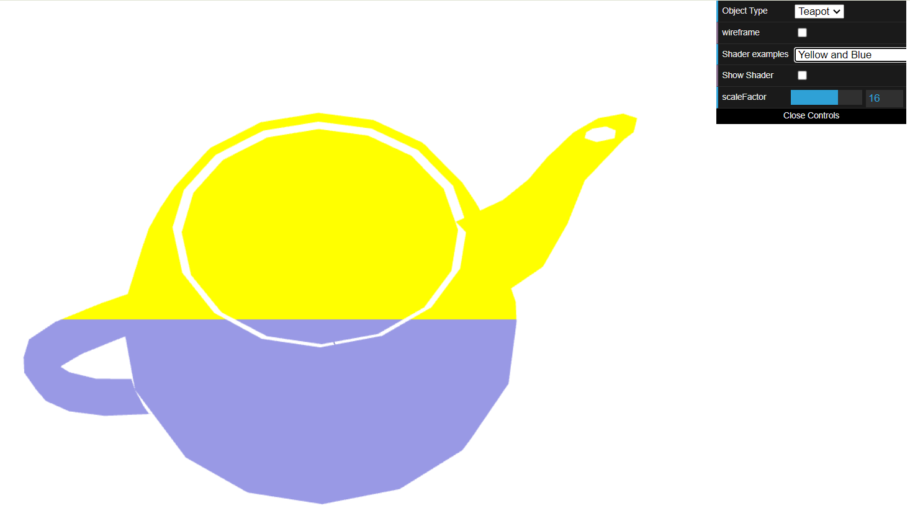
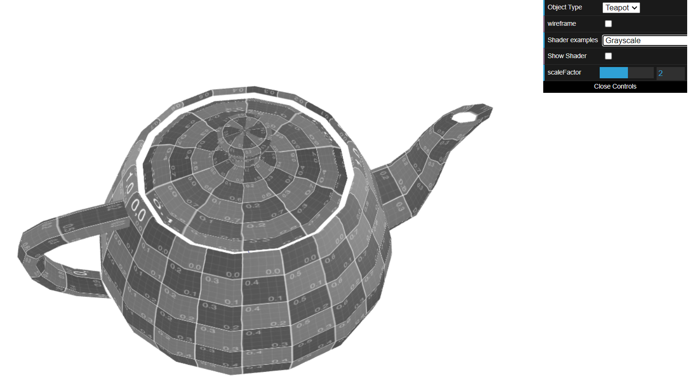
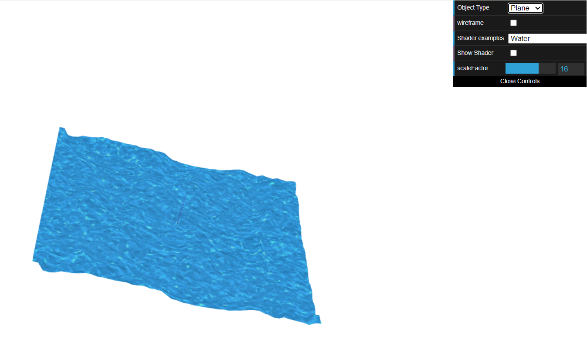

# CG 2023/2024

## Group T04G11

## TP 5 Notes

- In the first exercise, we added a shader that colored the teapot depending on the y coordinate of it's vertices. In this case, the top would be yellow, and the bottom blue.

 

- In the second exercise, used to previous sepia shader in order to create a grayscale sahder.

 

- To conclude, we created a shader using both the waterTex.png and waterMap.png files, in order to replicate the water effect on the plane with relief, using the timeFactor.

 